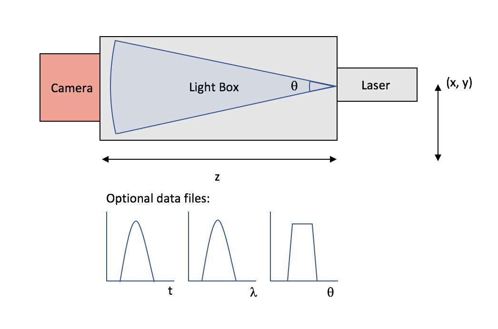
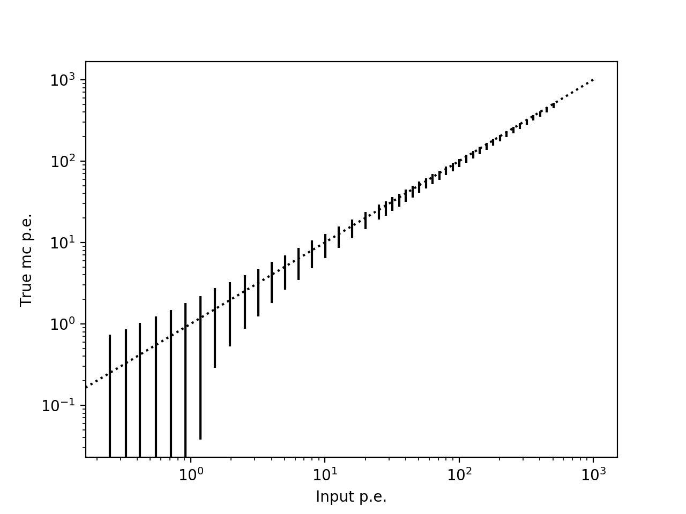
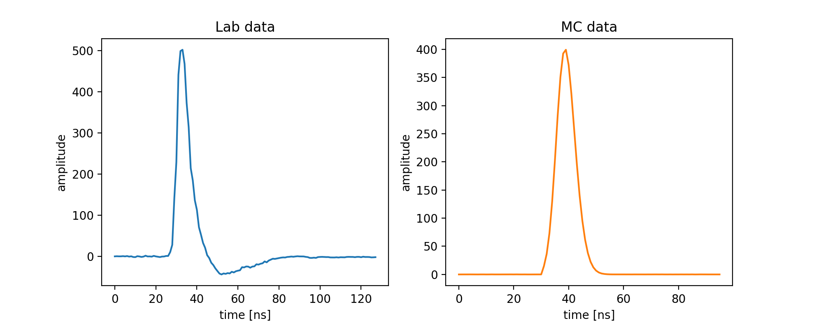
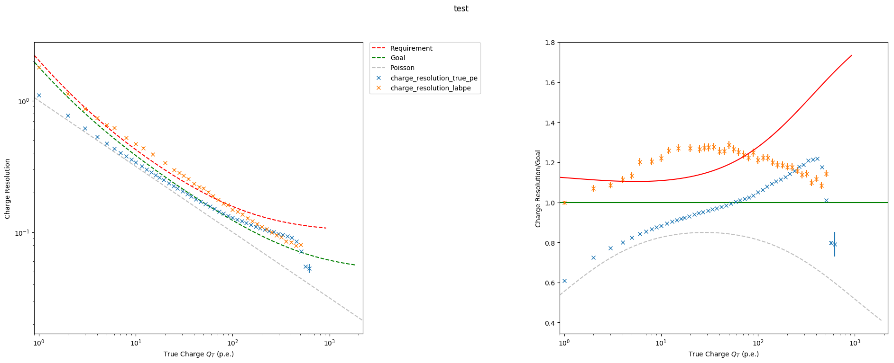

# MCValidation

The goal of this repository is to create some scripts and examples of how to produce and analise the MC data for the
MCValidation process, focusing on using the LightEmission package to replicate lab measurements. See [mcmeas.pdf](https://forge.in2p3.fr/projects/cta_analysis-and-simulations/repository/changes/Simulations/MCMeasurements/mcmeas.pdf)
which lays out some of the test measurements that will be used, and are generally grouped in the following cases: Pedestal and noise measurements,
basic photo-sensor response, pulsed light measurements with external trigger, pulsed light measurements with camera trigger and
electronic test pulses instead of light pulses. Before looking at each one of these it is important to evaluate the tools
that we need for this process.

# LightEmission Package

In order to simulate the lasers used in lab measurements and which can be read in by sim_telarray, we utalise the LightEmission
 package created by K Bernloehr (now part of the latest corsika_simtel distribution) which enables a generic light source to be
 defined by the number of emitted photons, light temporal, spectral and angular distribution (or single values).




One initial difficulty is defining the desired number of photo-electrons emitted as part of the light source. In lab measurements
the different light levels are generally created using a filterwheel, and the absolute illumination is calibrated by measuring the
detected number of photo-electrons and calibrate it using the single p.e. measurements [Needs confirmation and better description].
For now a simple approach has been adapted that takes the input requested geometry and the photon detection efficiency (along with
any other transmission factors) to calculate the required number of photons needed to produce a desired (average) number
of photo-electrons.


See the script get_photons.py which reads in a run list and provides the required number of photons emitted in LightEmission package to obtain the desired p.e. level.

```
python get_photons.py --runfile <File> --outfile <File> --pdefile <File> --transmission <File> --wavelength 400 --camera CHEC --ls_distance 1.5 --angular_distribution <File>
```

Looking at the distribution of true mc p.e. recorded from the simulation compared to the requested input (see following image), we see that they agree reasonably well.
There is, as is expected a slight bias due to the geometry and, in this case the curved focal plane, where we expect to see fewer photo-electrons
towards the edge of the camera.




Note that script doesnt doesn't currently take into account full distributions of wavelength or angle (issue #1). The light source can then simply be
simulated by running the following

```
./ff-1m --events <Nevents> --photons <Nphotons> --distance <z> --camera-radius <Rcam> --angular-distribution <File/isotropic> --spectrum <File/value> <(x, y)> -o <File>
```

which will produce a data file which is in the same format as a corsika file. This is put into sim_telarray using what ever configuration
that represents the camera you are simulating. Note that the additional flag BYPASS_OPTICS needs to be set in order to prevent the telescope structure
and mirrors. A helper script has been created, run_simtel.py which runs the light emission package and sim_telarray. Also can generate a pixel mask file

example run:

```
python run_simtel.py --infile runlist.txt --outdir ~/Data/test_run --nevents 1 --runLightEmission --angdist ./angular_distribution.dat
--distance 100 --camradius 30 --runSimTelarray --nsb 0 --discthresh 0
```

Additionally, there are some helper scripts for the helper script... (the example...py). But these are mainly here to keep track
of some different runs performed and will be replaced with config files shortly (see issue #2).

# Assumed data formats:

For this work, we assume that the data is organised as separate runs (RunX.format) in a folder which has a corresponding
runlist.dat, where the dat file contains columns describing the data run (RunNumber, Filterwheel_position, Filterwheel_attenuation,
Npe, Nphotons*, Nevents, NSB+noise, discriminator_threshold)

In order to read in data from the different cameras, readers in ctapipe need to be implemented and if necessary the
relevant camera softwehere needs to be installed.

# Data Exploration

There are plenty of example scripts available in ctapipe/examples. Here we simply put a few specific examples that have
been created here.

compare_waveforms.py - simple script to view waveforms in parallel for lab and MC, this can simply be run as

```
python compare_waveforms.py --mcfile data/runX.simtel.gz --labfile data/runX.format
```

which would give you all the waveformes in each file, but there are also some extra flags that let you select pixels etc.
The output should look something like:




---
# Lab/MC Measurements

The following are measurement categories taken from mcmeas.pdf meantioed at the start. The quotes are the text extracted
from the document followed by description of the method(s) that will be implemented.

## Pedestal and Noise Measurements

> Baseline (pedestal) measurements without any light source and with increasing levels of nonpulsed
> background light (emulating NSB over the expected range in observations, e.g. from zero
> to maximum operational rate in the requirements). The documentation must include how the rates
> were determined. Where possible, such measurements should be available with both the readout
> window length as intended for later operation and with a window length as long as possible to
> extract also lower-frequency noise contributions. (Single sensors or camera parts. Relevant for
> MC parameters and algorithms related to pedestals, electronics noise, and dark count rates.)

To simulate this, there are now two methods. 1) Simply use a dummy corsika event (such as one created by the flatfielding
code with only 1 photon) and increase the NSB parameter, or 2) use the new NSB code, nsbls, available with the LightEmission
package.

## Basic Photo-Sensor Response

> For normal incidence the PDE (photon detection efficiency) for SiPM at the bias voltage as used
> in the camera. QE and CE (quantum efficiency / collection efficiency) for PMTs, over the light
> collector exit area, using a mask in front of the photocathode, at nominal gain. (Single sensors
> or camera parts. Not all of these measurements will have a direct comparison in simulations, e.g.
> when measuring the photocathode currents for the quantum efficiency of PMTs.)

Not considered for now.

> Light collector plus photosensor efficiency versus angle of incidence, either in absolute units
> as for normal incidence or relative to the efficiency of the masked PMT (and scaled of light collector
> exit area over entry area).

This could be performed by setting the position of the light source and angular distribution in order to match a specified
measurement, however this could only be done relative to on axis efficiency. Not considered for now.

> Afterpulsing measurements for PMTs (between 4 and 40 p.e. or to amplitudes beyond which the
> afterpulse probability is < 10−9), revealing integral afterpulse fractions and spectrum of afterpulses.
> Either with non-pulsed light source or cumulative over all relevant afterpulsing delays. In
> order to have a reproducible p.e.-scale, raw data taken with camera electronics is recommended
> for this purpose, together with matching calibration measurement data. Other ways to measure
> afterpulsing are acceptable as long as the p.e. scale is well-defined.

It seems like this is only nescesery to provide the data for the pm_photoelectron_spectrum parameter?

> SiPM dark count measurements at the bias voltage as used in the camera, revealing dark count
> rate and pure optical-cross talk probability. In addition to measurements with the camera electronics,
> additional measurements with low-noise electronics are appreciated for this purpose, in
> particular for the width of the individual peaks in the amplitude distribution.

Same as above? Do we want to be able to reproduce the measured SPE? For this then we just need to have a script to create
the SPE distribution. Code for this already exists but I can include it here. Issue #4

## Pulsed Light Measurements with External Trigger

> Pulsed light measurements at low illumination levels (“single-p.e.”) together with off-pulse (“dark”)
> control measurements. For disentangling the single-p.e. response from the superposition of multiple
> photoelectrons, measurements at multiple illumination levels – best with known attenuation
> ratios – from well below one p.e. up to a few p.e. are recommended but knowledge of absolute
> levels is not necessary. At operational gain (PMT) or bias voltage (SiPM). Measurements with
> the readout system of the camera are suitable for gain calibration (matching pedestal measurements
> also needed). Measurements with separate low-noise readout suitable for r.m.s. width of
> the individual peaks in the SiPM amplitude distribution and, for PMTs, for following the single-p.e.
> amplitude distribution down to lower amplitudes than available with the camera readout.

Setting up measurements for gain calibration shouldnt be to hard, just need script to derive the single p.e. spectrum.

> Pulsed light measurements at moderate illumination levels (flat-fielding style) with external trigger,
> for pulse shapes and timing accuracy. Proper documentation of light pulse intrinsic shape is
> necessary. Also documentation on the stability of the external trigger with respect to the actual
> light pulse. Changing illumination levels via known optical attenuation, also down to low levels for
> corresponding single-p.e. calibration, is preferred but other types of attenuation are acceptable
> as long as attenuation ratios, light pulse shape, and trigger delay are under control. These measurements
> are most likely available as part of the charge resolution validation, B-xST-1010 and
> the time resolution validation, B-xST-1030. They may include different levels of emulated NSB.
> (Requires a significant part of a camera.)

This involves simulating a dynamic range run, script to obtain the charge resolution already exists, see
extract_trigger_efficiency.py. The required documentation of the pulse intrinsic shape will be used to setup the light
source simulation.

exctract_charge_resolution.py

python extract_charge_resolution.py --input_path ./d2018-02-09_DynRange_NSB0_mc --max_events 10 -o ./charge_resolution_test.h5 --calibrator HESSIOR1Calibrator -T 1 --plot_cam False --use_true_pe True

result can be plotted using

python .../ctapipe/ctapipe/tools/plot_charge_resolution.py -f="['./charge_resolution_true_pe.h5', './charge_resolution_labpe.h5']"  -O ./comp_charge_res.png




> Pulse shapes at different pulse illumination levels (available with previous set of measurements
> for all camera types with trace readout). In addition to readout of normal trace length it may also
> be useful to obtain measurements with longer readout covering the tails of the pulses.

Simple to implement, obtain average pulse shape/waveform at each illumination.

> Instead of the previous measurement, for cameras without trace readout it may be possible to
> measure the (integral or peak) signal at different delays of the external trigger.

Need better understanding of how to set this up.

> Pulsed light measurements at high illumination levels: changing pulse shapes, high-gain to lowgain
> ratio, and non-linearity (at least up to required levels, typically 1000 p.e., optionally well
> beyond).

Just a combination of the previous measurements?

## Pulsed Light Measurements with Camera Trigger

> Efficiency of the camera trigger as a function of illumination level (after calibration expressed in
> corresponding level of photoelectrons). Measurements can either be with all but selected pixels
> covered by a mask or by disabling all other pixels (i.e. turning the HV off). Should include different
> multiplicities and topologies of activated pixels, within a trigger group and crossing boundaries of
> trigger groups (sometimes referred to as “sectors”, sometimes as “patches”). These measurements
> are particularly important for verifying the compliance with B-xST-1230 and for predicting
> the telescope energy threshold (see example in Section 2). Most relevant are multiplicities
> and topologies roughly corresponding to typical images near detection threshold. Also of interest
> would be a muon-ring-like topology.

Can be done with a similar dataset as before, script exists (see extract_trigger_efficiency.py). The functionality of
the mask code needs some improvement.

> Position of pulses in the readout window for different illumination levels, for the measurements
> as before. Both for illumination levels barely triggering and for high intensities the pulses should
> be well contained in the readout window.

## Electronic Test Pulses Instead of Light Pulses

> Some measurements are more readily done with electronic pulse generators rather than with pulses
> from the photosensors. Such measurements may also be suitable for testing the electronics chain
> simulation.

> Effective trigger window The signal from an appropriate signal generator, that mimics a Cherenkov
> signal and is large enough to trigger, is fed in the minimum number of channels that can trigger
> the readout. The signal in one channel is externally delayed and the trigger efficiency recorded as
> function of time difference to determine the effective trigger window

> Analog-sum trigger with clipping Recording the output signal of the clipping and sum stage as
> a function of input signal amplitude. Recorded should be the full pulse shape and over a range
> that results in clipping of the signal to determine the transfer function of the clipping stage.

___

## Lab measurements not covered above

Rate scan?